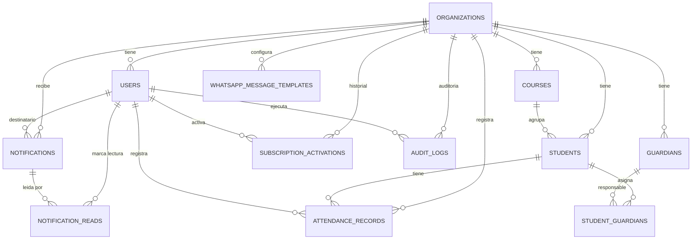
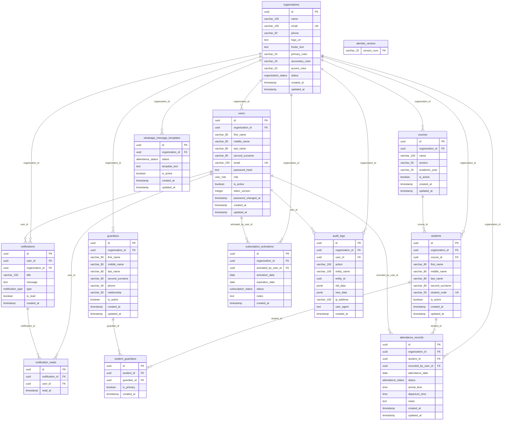

# Diagramas logico y fisico de base de datos

Proyecto: `ReySoft-Asistencia`

Fecha de actualizacion: 2026-05-24

Fuente tecnica usada para este documento:

- Modelos SQLAlchemy en `backend/app/models/`
- Migraciones Alembic hasta `20260524_0008_add_notification_reads.py`
- Esquema consolidado en `docs/current_database_schema.sql`
- Reglas vigentes de backend y frontend para tutores multiples por estudiante

Este documento describe la base de datos vigente del proyecto. Los diagramas estan escritos en Mermaid para poder renderizarlos en GitHub, editores Markdown compatibles o herramientas de documentacion.

## 1. Resumen del modelo actual

La base de datos usa PostgreSQL, UUID como claves primarias y un modelo SaaS multiempresa basado en `organizations`.

Cada centro educativo es una organizacion. Los datos escolares operativos se separan por `organization_id` en las tablas principales:

- `users`
- `courses`
- `guardians`
- `students`
- `attendance_records`
- `whatsapp_message_templates`
- `notifications`
- `subscription_activations`
- `audit_logs`

La lectura de notificaciones se registra por usuario en `notification_reads`, lo que permite que una misma notificacion de un centro sea visible para `school_admin` y `staff` sin compartir el estado de leida.

Los padres o tutores no tienen una tabla separada de autenticacion. El acceso para padres se resuelve usando registros de `guardians` y su `phone`.

La base de datos ya modela la relacion estudiante-tutor como muchos a muchos. Por tanto, un estudiante puede tener varios tutores asociados y uno solo marcado como tutor principal.

## 2. Diagrama logico

Este diagrama muestra las entidades de negocio y sus relaciones principales, sin detallar todos los tipos fisicos de columnas.

## 3. Diagrama fisico

Este diagrama muestra las tablas, columnas principales, claves primarias, claves foraneas y restricciones unicas relevantes.

## 4. Enumeraciones PostgreSQL

### `organization_status`

- `pending`
- `active`
- `suspended`
- `cancelled`

### `user_role`

- `super_admin`
- `school_admin`
- `staff`

### `attendance_status`

- `arrived`
- `absent`
- `late`
- `early_pickup`
- `excused`

### `subscription_status`

- `active`
- `expired`
- `cancelled`

### `notification_type`

- `info`
- `success`
- `warning`
- `error`
- `new_registration`
- `activation`

## 5. Catalogo fisico de tablas

### `organizations`

Representa los centros educativos.

Campos principales:

- `id`: UUID PK.
- `name`: nombre del centro.
- `email`: correo unico del centro.
- `phone`: telefono del centro.
- `logo_url`: URL o ruta del logo subido.
- `footer_text`: footer configurable por centro.
- `primary_color`, `secondary_color`, `accent_color`: colores hexadecimales.
- `status`: estado operativo del centro.
- `created_at`, `updated_at`: auditoria temporal basica.

Restricciones:

- `email` unico.
- Colores deben cumplir `^#[0-9A-Fa-f]{6}$`.
- `footer_text` debe ser `NULL` o tener hasta 500 caracteres.

### `users`

Representa usuarios internos del sistema.

Campos principales:

- `id`: UUID PK.
- `organization_id`: FK nullable a `organizations`.
- `first_name`, `middle_name`, `last_name`, `second_surname`: nombre estructurado.
- `email`: correo unico del usuario.
- `password_hash`: hash bcrypt; no debe exponerse en API.
- `role`: rol del usuario.
- `is_active`: estado del usuario.
- `token_version`: version de sesion JWT para invalidar tokens antiguos.
- `password_changed_at`: fecha de ultimo cambio de contrasena.
- `created_at`, `updated_at`: auditoria temporal basica.

Restricciones:

- `email` unico.
- `super_admin` debe tener `organization_id IS NULL`.
- `school_admin` y `staff` deben tener `organization_id IS NOT NULL`.

### `courses`

Representa cursos, grados o secciones.

Restricciones:

- FK `organization_id` a `organizations`.
- Un curso no se duplica dentro de la misma organizacion por la combinacion:
  `organization_id`, `name`, `section`, `academic_year`.
- `is_active` permite conservar historial sin eliminar.

### `guardians`

Representa tutores, padres o responsables.

Campos relevantes:

- Nombre estructurado con `first_name`, `middle_name`, `last_name`, `second_surname`.
- `phone` obligatorio, usado para acceso de padres y enlaces de WhatsApp.
- `relationship`: relacion con el estudiante.
- `is_active`: estado logico.

Nota:

- La limpieza del telefono se hace en backend antes de usarlo para WhatsApp o login de padres.

### `students`

Representa estudiantes.

Campos relevantes:

- FK `organization_id`.
- FK `course_id`.
- Nombre estructurado.
- `student_code`: codigo unico dentro de la organizacion.
- `is_active`: estado logico.

Restricciones:

- `UNIQUE (organization_id, student_code)`.
- No se guarda nombre de curso como texto; se usa `course_id`.
- No se guarda tutor como texto; se usa `student_guardians`.

### `student_guardians`

Tabla intermedia muchos a muchos entre estudiantes y tutores.

Uso de negocio:

- Un estudiante puede tener varios tutores.
- Un tutor puede estar asociado a varios estudiantes.
- Solo una relacion por estudiante puede tener `is_primary = TRUE`.
- El tutor principal se usa como contacto por defecto para WhatsApp.
- El portal de padres muestra los estudiantes asociados al tutor autenticado por telefono.

Restricciones:

- `UNIQUE (student_id, guardian_id)` evita asignaciones duplicadas.
- Indice unico parcial `uq_one_primary_guardian_per_student` permite solo un tutor principal por estudiante.

Nota importante:

- Esta tabla no tiene `organization_id`.
- La regla de que estudiante y tutor pertenezcan a la misma organizacion se valida en backend, no por FK directa de PostgreSQL.

### `attendance_records`

Registra la asistencia diaria.

Campos relevantes:

- `organization_id`: centro educativo.
- `student_id`: estudiante.
- `recorded_by_user_id`: usuario que registro la asistencia, nullable.
- `attendance_date`: fecha.
- `status`: estado de asistencia.
- `arrival_time`: hora de llegada.
- `departure_time`: hora de retiro.
- `notes`: notas.

Restricciones actuales:

- Se permite un registro regular por estudiante y fecha cuando `status != 'early_pickup'`.
- Se permite un registro adicional por estudiante y fecha solo cuando `status = 'early_pickup'`.

Esto se implementa con indices unicos parciales:

- `uq_attendance_regular_record_per_student_day`
- `uq_attendance_early_pickup_per_student_day`

### `whatsapp_message_templates`

Plantillas de mensajes por organizacion y estado de asistencia.

Restriccion:

- `UNIQUE (organization_id, status)` asegura una plantilla por estado dentro del centro.

Incluye el estado `excused`.

### `notifications`

Notificaciones internas.

Uso principal:

- Notificaciones para superadmin, usuarios especificos o centros completos.
- `organization_id` permite que la notificacion sea visible para usuarios activos del mismo centro.
- `user_id` permite dirigir una notificacion a un usuario especifico.
- `is_read` se conserva para compatibilidad, pero el estado individual de lectura se registra en `notification_reads`.

### `notification_reads`

Lecturas de notificaciones por usuario.

Uso principal:

- Permite que `school_admin` y `staff` vean la misma notificacion del centro con estados de lectura independientes.
- Evita marcar como leida globalmente una notificacion compartida.

Restriccion:

- `UNIQUE (notification_id, user_id)` evita registrar dos lecturas iguales para el mismo usuario.

### `subscription_activations`

Historial de activaciones realizadas por el `super_admin`.

Campos relevantes:

- `organization_id`: centro activado.
- `activated_by_user_id`: usuario superadmin que activo.
- `activation_date`: fecha de activacion.
- `expiration_date`: fecha de expiracion opcional.
- `status`: estado de la activacion.
- `notes`: notas administrativas.

Nota:

- La suspension automatica por expiracion se ejecuta en backend cuando se sincroniza el estado de la organizacion.

### `audit_logs`

Auditoria de acciones importantes.

Campos relevantes:

- `organization_id`: organizacion afectada, nullable.
- `user_id`: usuario que ejecuto la accion, nullable.
- `action`: accion realizada.
- `entity_name`, `entity_id`: entidad afectada.
- `old_data`, `new_data`: cambios en JSONB.
- `ip_address`, `user_agent`: contexto opcional.
- `created_at`: fecha de auditoria.

## 6. Indices y restricciones relevantes

### Indices por estado y busqueda

- `idx_organizations_status`
- `idx_users_role`
- `idx_attendance_date`
- `idx_attendance_status`
- `idx_notifications_is_read`
- `idx_notification_reads_user_id`
- `idx_audit_logs_action`

### Indices por multiempresa

- `idx_users_organization_id`
- `idx_courses_organization_id`
- `idx_guardians_organization_id`
- `idx_students_organization_id`
- `idx_attendance_organization_id`
- `idx_whatsapp_templates_organization_id`
- `idx_subscription_organization_id`
- `idx_audit_logs_organization_id`

### Indices relacionales

- `idx_students_course_id`
- `idx_student_guardians_student_id`
- `idx_student_guardians_guardian_id`
- `idx_attendance_student_id`
- `idx_notifications_user_id`
- `idx_notification_reads_notification_id`
- `idx_audit_logs_user_id`

### Unicos de negocio

- `organizations.email`
- `users.email`
- `courses(organization_id, name, section, academic_year)`
- `students(organization_id, student_code)`
- `student_guardians(student_id, guardian_id)`
- `notification_reads(notification_id, user_id)`
- `whatsapp_message_templates(organization_id, status)`

### Unicos parciales

- `student_guardians(student_id) WHERE is_primary = TRUE`
- `attendance_records(student_id, attendance_date) WHERE status != 'early_pickup'`
- `attendance_records(student_id, attendance_date) WHERE status = 'early_pickup'`

## 7. Cascadas y comportamiento al eliminar

Si se elimina una organizacion en base de datos:

- `users`: `ON DELETE CASCADE`
- `courses`: `ON DELETE CASCADE`
- `guardians`: `ON DELETE CASCADE`
- `students`: `ON DELETE CASCADE`
- `attendance_records`: `ON DELETE CASCADE`
- `whatsapp_message_templates`: `ON DELETE CASCADE`
- `notifications`: `ON DELETE CASCADE`
- `notification_reads`: se elimina por cascada si se elimina su notificacion o usuario relacionado.
- `subscription_activations`: `ON DELETE CASCADE`
- `audit_logs`: `ON DELETE SET NULL`

Otras reglas:

- Si se elimina un curso con estudiantes asociados, `students.course_id` usa `ON DELETE RESTRICT`.
- Si se elimina un usuario que registro asistencia, `attendance_records.recorded_by_user_id` queda `NULL`.
- Si se elimina un usuario activador, `subscription_activations.activated_by_user_id` queda `NULL`.
- Si se elimina un usuario auditado, `audit_logs.user_id` queda `NULL`.
- Si se elimina un estudiante, se eliminan sus relaciones `student_guardians` y sus asistencias.
- Si se elimina un tutor, se eliminan sus relaciones en `student_guardians`.

## 8. Reglas validadas por backend, no solo por FK

Algunas reglas son de integridad de negocio y se validan en FastAPI/servicios, porque PostgreSQL no las puede garantizar con las FK simples actuales sin agregar claves compuestas adicionales.

Reglas principales:

- Un `course_id` usado por un estudiante debe pertenecer a la misma `organization_id` del usuario.
- Un estudiante y un tutor asignados en `student_guardians` deben pertenecer a la misma organizacion.
- Al crear un estudiante, la interfaz permite seleccionar uno o varios tutores.
- Al crear un estudiante, debe existir al menos un tutor asociado.
- Una asistencia debe registrarse para un estudiante de la misma organizacion del usuario.
- `recorded_by_user_id` debe pertenecer a la misma organizacion del estudiante, salvo casos administrativos controlados.
- Un usuario escolar no puede consultar datos de otra organizacion.
- Un tutor principal anterior se desmarca cuando se marca otro como principal.
- Al quitar una relacion estudiante-tutor, el estudiante debe conservar al menos un tutor.
- Si se quita el tutor principal y quedan otros tutores asociados, el backend promueve otro tutor como principal.
- El login escolar y el portal de padres bloquean organizaciones no activas.
- La expiracion de la activacion puede suspender automaticamente el centro.
- Las plantillas por defecto se crean al crear un centro.
- La importacion de estudiantes valida cursos y tutores dentro de la organizacion.
- El acceso de padres se resuelve por telefono de tutor; OTP fue eliminado.

## 9. Normalizacion

El modelo se mantiene en tercera forma normal para los datos principales:

- Los centros estan en `organizations`.
- Los usuarios escolares referencian `organizations`, no duplican datos del centro.
- Los estudiantes referencian `courses` por `course_id`, no guardan el nombre del curso.
- Los tutores no se guardan como texto dentro de estudiantes.
- La relacion estudiante-tutor se modela como muchos a muchos mediante `student_guardians`.
- Los nombres personales se guardan estructurados en partes, no como `full_name` persistido.
- Las plantillas de WhatsApp se guardan por organizacion y estado.
- La auditoria se separa en `audit_logs`.

## 10. Cambios actuales incluidos

Este documento ya contempla los cambios recientes del proyecto:

- Nombre del producto actualizado a `ReySoft-Asistencia`.
- Registro publico de centros eliminado; los centros los crea `super_admin`.
- Logos mediante subida de imagenes; se persiste `logo_url`.
- Footer configurable por centro con `footer_text`.
- Nombres personales divididos en `first_name`, `middle_name`, `last_name`, `second_surname`.
- JWT endurecido con `token_version` y `password_changed_at`.
- Estado de asistencia `excused`.
- Segundo registro diario permitido solo para `early_pickup`.
- Acceso de padres por telefono del tutor, sin OTP.
- Gestion visual de varios tutores por estudiante desde la pantalla de estudiantes.
- Proteccion para que un estudiante no quede sin tutor al quitar relaciones.
- Reportes de asistencia por estudiante y por curso.
- Exportacion de reportes en Excel y PDF.
- Importacion/exportacion de estudiantes por Excel y CSV.
- Estado `manual` eliminado de `subscription_status`; los estados vigentes son `active`, `expired` y `cancelled`.

## 11. Observaciones tecnicas

- `alembic_version` no es una entidad de negocio; solo registra la version de migracion aplicada.
- Los reportes no tienen tabla propia; se calculan desde `attendance_records`, `students`, `courses` y `guardians`.
- Las exportaciones Excel/PDF y la importacion Excel/CSV no agregan tablas nuevas.
- La seguridad web agregada recientemente no cambia el esquema fisico de base de datos.
- Si se quiere reforzar la integridad de "misma organizacion" directamente en PostgreSQL, se podrian evaluar FK compuestas o agregar `organization_id` a `student_guardians`, pero actualmente esa garantia esta implementada en backend.
